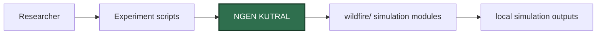

<p align="center">
  <strong>NGEN KUTRAL</strong><br />
  Python wildfire spread simulation framework with experiment scripts for JCC 2018 figures.
</p>

<p align="center">
  
  
  
</p>

<p align="center">
  <code>Wildfire</code> | <code>Simulation</code> | <code>NumPy</code> | <code>SciPy</code> | <code>Matplotlib</code>
</p>

---

`ngen-kutral` contains Python source code for wildfire spread simulation and experiment scripts associated with the work "Ngen Kutral: Toward an Open Source Framework for Chilean Wildfire Spreading".

The repository is a source-code and experiment archive. It does not include a package manifest, pinned dependency file, Dockerfile, or continuous integration workflow.

## Product Surface

| Area | Contract |
| --- | --- |
| Runtime | Python scripts and modules |
| Core package | `wildfire/` |
| Experiment entry points | `experiments/` and `experiments/JCC2018/` |
| Data path | Experiment scripts import simulation modules and write generated outputs locally |
| Storage | Git-tracked source and experiment scripts |
| Documentation | Root README plus `experiments/JCC2018/README.md` |
| Distribution | GitHub repository |

## Runtime Shape



## Responsibilities

- Provide wildfire simulation modules under `wildfire/`.
- Provide experiment scripts for reproducing selected JCC 2018 figures.
- Keep source code and experiment entry points available for inspection and reuse.
- Leave dependency pinning, packaging, and deployment to downstream users.

## How It Is Built

| File / Folder | Role |
| --- | --- |
| `wildfire/fire.py` | Fire simulation class and PDE-related computations. |
| `wildfire/diffmat.py` | Differentiation matrix utilities used by the simulation code. |
| `wildfire/plots.py` | Plotting helpers. |
| `experiments/` | General experiment scripts. |
| `experiments/JCC2018/` | Scripts used to generate JCC 2018 figures. |
| `LICENSE` | BSD 3-Clause license. |

## Platform and Service Dependencies

<table>
  <tr>
    <th>Service / Object</th>
    <th>Provider</th>
    <th>Usage</th>
    <th>Purpose</th>
  </tr>
  <tr>
    <td><code>NumPy</code></td>
    <td>Python package</td>
    <td>Array and numerical operations in simulation modules.</td>
    <td>Supports numerical wildfire model calculations.</td>
  </tr>
  <tr>
    <td><code>SciPy</code></td>
    <td>Python package</td>
    <td>Interpolation and optimization utilities.</td>
    <td>Supports scientific computation in the simulation workflow.</td>
  </tr>
  <tr>
    <td><code>Matplotlib</code></td>
    <td>Python package</td>
    <td>Plot generation in simulation and experiment scripts.</td>
    <td>Produces visual outputs for experiments and figures.</td>
  </tr>
</table>

## Local Development

Install the scientific Python dependencies expected by the source code:

```bash
python -m pip install numpy scipy matplotlib
```

Run an experiment from the repository root:

```bash
python experiments/JCC2018/asensio_2002.py
```

If imports fail, add the repository root to `PYTHONPATH`:

```bash
export PYTHONPATH="$PYTHONPATH:/path/to/ngen-kutral"
```

## Verification

No automated tests are defined. Recommended smoke checks are to run one script from `experiments/JCC2018/` and confirm that it completes with the expected generated figure or simulation output.

## Secret Handling

The repository does not require credentials. Do not commit generated private data, large local simulation outputs, or environment-specific paths unless they are intended as reproducible artifacts.

## License

This repository includes a BSD 3-Clause license.
